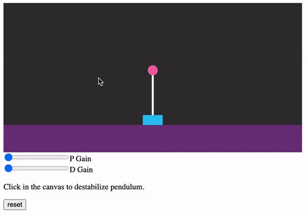

# Robot Controller Simulations

This repo includes source code and references for the Coding Train collaboration with Dr. Christian Hubicki building interactive simulations of robot controllers.

## PID Controller - Cart Pole Simulation

### References

- [Live Stream Archive](https://youtu.be/fWQWX9-8_sA)

### Source Code

- [Base Python code](https://tinyurl.com/cart-pole)
- [Final Python code](https://tinyurl.com/cartpole-control)
- [p5.js sketch](https://editor.p5js.org/codingtrain/sketches/sB1glTRe7)

- Try the demo: https://codingtrain.github.io/Robot-Controllers/pid-cart-pole/

## Dr. Christian Hubicki

Dr. Christian Hubicki is an Assistant Professor of Mechanical Engineering at Florida State University and the FAMU-FSU College of Engineering. As Director of the Optimal Robotics Laboratory, his research specializes in bipedal locomotion, specifically optimization methods that apply to both legged robotics and biomechanics.
